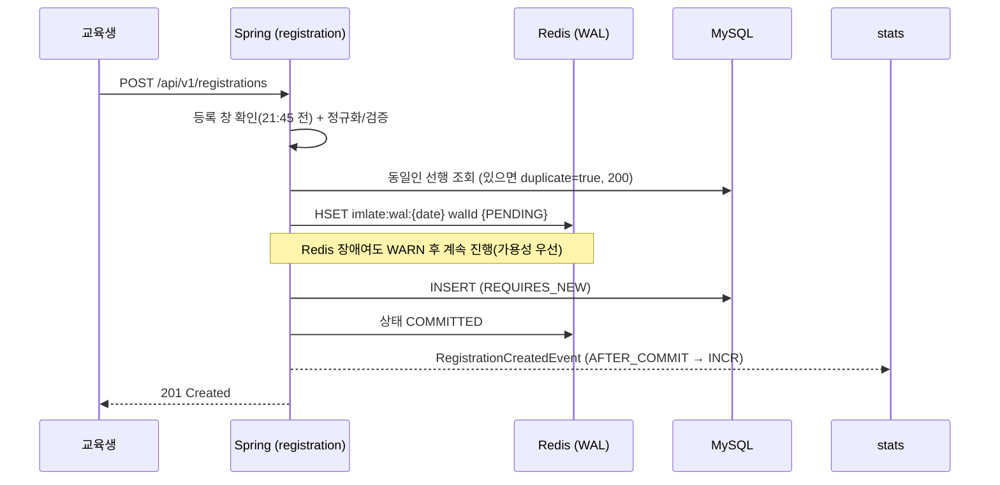

# imlate — 기숙사 야간 복귀(23:30) 등록 시스템

기숙사 통금은 원래 **22:30**이지만, 교육생 대표와 사감님의 합의로 **23:30까지 연장**되었습니다.
대신 사감님은 "누가 23:30에 들어오는지" 명단을 미리 받아야 합니다. imlate는 그 과정을 자동화합니다.
교육생은 **21:45까지** 웹에서 반·이름·호수를 등록하고, **21:50**에 시스템이 Redis WAL ↔ DB 대사를 마친 뒤
사감님 2분께 **문자(Aligo)와 이메일(Amazon SES)** 로 보기 좋은 명단과 조회 페이지 링크를 자동 발송합니다.
등록자가 0명이면 아무것도 보내지 않습니다.

> 등록은 **매일 00:00에 열리고 21:45에 닫힙니다.** 21:45 이후에는 그날 등록을 받지 않으며,
> 자정(00:00)이 되면 **다음 날 대상** 등록이 새로 열립니다.
> (마감 21:45 · 발송 21:50 은 운영자 요청으로 앞당겨진 값입니다. 자세한 이력은 [docs/SPEC.md §3](docs/SPEC.md) 참고)

| 영역 | 사용 기술 |
|---|---|
| 백엔드 | Java 21 · Spring Boot 3.4.1 · Spring Data JPA(Hibernate) · Flyway · Gradle 8.14 |
| 데이터 | MySQL 8 (AWS RDS) · Redis 7 (AWS ElastiCache) |
| 프론트 | Vue 3.5 · Vite 6 · TypeScript 5.7 · vue-router 4 (상태관리 라이브러리 없음) |
| 외부 연동 | Aligo REST(문자) · AWS SDK v2 SES v2(메일) |
| 인프라 | AWS (VPC/ALB/WAF/EC2/RDS/ElastiCache/SSM/SES) · Terraform ≥ 1.6 · nginx · systemd |
| 로컬 | Docker Compose (MySQL 8 + Redis 7) |
| 테스트 | JUnit 5 · Testcontainers · H2 (백엔드) · Playwright (프론트 E2E) |

> Lombok을 쓰지 않습니다. 생성자·getter는 직접 작성하고 DTO는 `record`입니다.
> 모든 시각 계산은 주입받은 `java.time.Clock`(Asia/Seoul)으로만 합니다.

---

## 1. 요구사항 → 구현 매핑

| # | 요구사항 | 구현 위치 |
|---|---|---|
| R1 | 21:45까지 웹에서 23:30 복귀 등록 | `registration/service/RegistrationWindowPolicy.java`, `frontend/src/views/RegisterView.vue` |
| R2 | 등록 항목 = 반 / 이름 / 기숙사 호수 | `registration/domain/ReturnRegistration.java`, `registration/web/dto/RegistrationRequest.java` |
| R3 | 21:50 사감 2명에게 문자+메일, 0명이면 미발송 | `notification/scheduler/CurfewNotificationScheduler.java`, `notification/service/CurfewNotificationService.java` (`skipReason=NO_REGISTRATION`) |
| R4 | 목록에 반·이름·호수, 보기 좋은 텍스트 | `notification/template/CurfewNoticeRenderer.java` (전각 폭 2 반영 고정폭 표) |
| R5 | 미니멀 · 전 디바이스 반응형 · 검증 완료 | `frontend/src/styles/*`, `frontend/src/views/*`, Playwright E2E |
| R6 | 이전 입력값 기억 → 자동 채움 | `frontend/src/composables/useLastInput.ts` (`imlate.lastInput`, `imlate.recentInputs`) |
| R7 | Redis WAL 1회 → DB 1회 (누락 방지) | `registration/wal/RegistrationWalRepository.java`, `registration/service/RegistrationService.java` |
| R8 | 마감 후 Redis ↔ DB 대사 → 조회 페이지 | `registration/service/ReconciliationService.java`, `registration/web/LookupController.java`, `frontend/src/views/LookupView.vue` |
| R9 | 조회 페이지 주소 + 안내/통계를 문자·메일로 | `CurfewNotificationService#buildLookupUrl`, `common/security/AccessTokenService.java` |
| R10 | 설정 파일 분리(키/비번/AWS) | `backend/src/main/resources/application*.yml`, `application-secret.yml.example`, SSM Parameter Store |
| R11 | 문자=Aligo, 메일=Amazon SES | `notification/channel/AligoSmsSender.java`, `notification/channel/SesEmailSender.java` |
| R12 | AWS(EC2/RDS/ElastiCache) + Terraform | `infra/terraform/**` |
| R13 | Java/Spring, MySQL, JPA / Vue.js | 전체 |
| R14 | Rate limiter (DDoS·과다요청 대응) | `ratelimit/**` (Redis Lua 토큰 버킷) + `infra/terraform/modules/waf` + `infra/nginx/imlate.conf` |
| R15 | 총/일별 방문자수·등록수 통계 | `stats/**` (Redis 카운터 + `daily_stat` 스냅샷) |
| 기타 | 도커 | `docker-compose.yml` (로컬 MySQL 8 + Redis 7) |
| 기타 | GitHub Actions | **미구성** — 현재는 `infra/scripts/deploy.sh` 수동 배포 |

---

## 2. 아키텍처 한눈에 보기

```
   [교육생 브라우저]                                   [사감님]
   Vue 3 SPA (dist)                                   문자 / 이메일
         │                                                  ▲
         │ HTTPS                                            │ 21:50
         ▼                                                  │
   ┌──────────────┐   WAF(IP당 5분 2000요청)                 │
   │     ALB      │                                         │
   └──────┬───────┘                                         │
          │  :8080 (또는 :80 nginx)                          │
   ┌──────▼──────────────────────────────────────────┐      │
   │  EC2  nginx(정적 dist + /api 프록시)             │      │
   │       Spring Boot (imlate.jar, systemd)         │──────┘
   │  ├ registration  ├ notification                 │   Aligo REST
   │  ├ ratelimit     ├ stats   ├ common             │   AWS SES v2
   └───┬──────────────────────────────┬──────────────┘
       │                              │
  ┌────▼─────────┐            ┌───────▼────────────────────────┐
  │ RDS MySQL 8  │            │ ElastiCache Redis 7            │
  │ return_      │            │ imlate:wal:{date}   (WAL)      │
  │  registration│            │ imlate:rl:{scope}:{ip}         │
  │ notification_│            │ imlate:stats:*                 │
  │  dispatch    │            │ imlate:lock:dispatch:{date}    │
  │ daily_stat   │            └────────────────────────────────┘
  └──────────────┘
```



자세한 내용은 [docs/ARCHITECTURE.md](docs/ARCHITECTURE.md)를 참고하세요.

---

## 3. 빠른 시작 (로컬)

사전 준비: **JDK 21+**, **Node.js 20.19+**, **Docker**

```bash
# 1) 로컬 인프라 (MySQL 8 + Redis 7)
docker compose up -d
docker compose ps          # 두 컨테이너가 healthy 가 될 때까지 대기

# 2) 백엔드 (http://localhost:8080)
cd backend
./gradlew bootRun --args='--spring.profiles.active=local'
#   Windows PowerShell: .\gradlew.bat bootRun --args='--spring.profiles.active=local'

# 3) 프론트엔드 (http://localhost:5173)
cd ../frontend
npm install
npm run dev
```

브라우저에서 <http://localhost:5173> 을 엽니다. `/api` 요청은 Vite dev 서버가 `http://localhost:8080` 으로 프록시합니다.

> **PC 에 MySQL / Redis 가 이미 설치되어 있다면** `docker compose up -d` 가 포트 충돌로 실패합니다
> (`Bind for 0.0.0.0:3306 failed: port is already allocated`).
> 기존 서비스를 끄지 말고, 프로젝트 루트에 `.env` 를 만들어 컨테이너 포트만 옮기세요.
>
> ```bash
> # .env
> IMLATE_MYSQL_PORT=13306
> IMLATE_REDIS_PORT=16379
> ```
>
> 그리고 백엔드를 실행할 때 같은 포트를 알려 줍니다.
>
> ```bash
> IMLATE_DB_URL="jdbc:mysql://localhost:13306/imlate?useSSL=false&allowPublicKeyRetrieval=true&serverTimezone=Asia/Seoul&characterEncoding=UTF-8" \
> IMLATE_REDIS_PORT=16379 \
> ./gradlew bootRun --args='--spring.profiles.active=local'
> ```

> **Windows 에서 curl 로 한글을 보내면** 콘솔 인코딩 때문에 본문이 깨져
> `400 VALIDATION_FAILED`("요청 본문을 읽을 수 없습니다") 가 날 수 있습니다. 앱 문제가 아닙니다.
> 브라우저나 Postman 을 쓰거나, JSON 을 UTF-8 파일로 저장해 `--data-binary @body.json` 으로 보내세요.

`local` 프로파일에서는 문자/이메일이 실제로 발송되지 않습니다(`imlate.sms.provider=noop`, `imlate.email.provider=noop`).
로그에만 남고 성공으로 처리됩니다.

### 사감 조회 페이지를 로컬에서 보려면

조회 페이지는 HMAC 서명 토큰이 필요합니다. 관리 API로 발송 미리보기를 호출하면 링크가 함께 나옵니다.

```bash
curl -s -X POST "http://localhost:8080/api/v1/admin/notifications/preview" \
  -H "X-Admin-Key: local-dev-admin-key"
# 응답의 lookupUrl 을 브라우저에 붙여넣으면 /lookup?date=...&token=... 화면이 열립니다.
```

---

## 4. 하루 타임라인

| 시각 | 일어나는 일 | 설정 키 / 구현 |
|---|---|---|
| **00:00** | 당일(= 그날 밤 복귀 대상일) 등록 시작 | `imlate.registration.open-time` |
| ~21:45 | 교육생이 반·이름·호수 등록 (Redis WAL → MySQL) | `RegistrationService#register` |
| **21:45 정각** | 등록 마감. 이후 요청은 `409 REGISTRATION_CLOSED` | `imlate.registration.close-time` |
| **21:50** | 분산 락 → WAL↔DB 대사(누락 복구) → 명단 렌더 → 사감 문자/메일 발송 | `imlate.notification.dispatch-cron` = `0 50 21 * * *` |
| 22:05, 22:20 | 실패한 채널만 재발송 | `imlate.notification.retry-cron` = `0 5,20 22 * * *` |
| **22:30** | 기숙사 출입문 잠김(안내 문구용 값) | `imlate.registration.curfew-time` |
| **23:30** | 명단의 교육생이 일괄 입관(안내 문구용 값) | `imlate.registration.return-time` |
| 23:55 | 당일 통계를 `daily_stat` 에 선반영 | `imlate.stats.today-snapshot-cron` (코드 기본값 `0 55 23 * * *`) |
| 00:05 | 전일 통계 확정 + 보존 기간 초과분 정리 | `imlate.stats.snapshot-cron` = `0 5 0 * * *` |

한 줄로 보면 이렇습니다.

```
00:00 등록 시작 → 21:45 마감 → 21:50 사감 발송 → (22:05 / 22:20 실패분 재시도)
                → 22:30 출입문 잠김 → 23:30 일괄 개방
```

**21:45 이후에는 그날 등록이 닫히고, 자정(00:00)에 다음 날 대상 등록이 열립니다.**
마감과 통금(22:30) 사이 45분은 사감님이 명단을 받아 확인하는 시간입니다.

모든 시각은 **Asia/Seoul** 기준이며, 스케줄러 cron에도 `zone = ${imlate.timezone}` 이 지정되어 있습니다.
표의 시각은 전부 **설정값의 기본값**일 뿐 코드에 박혀 있지 않습니다 — 변경 절차는
[docs/OPERATIONS.md §5.2](docs/OPERATIONS.md) 를 보세요.

---

## 5. 프로젝트 구조

```
skala-imlate/
├─ README.md                       이 문서
├─ docker-compose.yml              로컬 MySQL 8 + Redis 7
├─ docs/
│  ├─ SPEC.md                      구현 계약서(단일 진실 공급원)
│  ├─ ARCHITECTURE.md              컴포넌트·시퀀스·데이터 모델·장애 시나리오
│  ├─ API.md                       전체 엔드포인트 명세
│  ├─ OPERATIONS.md                일일 운영·장애 대응 런북
│  └─ DEPLOYMENT.md                AWS 배포 절차
├─ backend/
│  ├─ build.gradle · settings.gradle · gradlew*
│  └─ src/main/
│     ├─ java/com/skala/imlate/
│     │  ├─ ImlateApplication.java
│     │  ├─ common/       properties · error · config(Clock/Redis/Web/Jackson/Async) · security · web
│     │  ├─ registration/ domain · wal · event · service · web(+dto)
│     │  ├─ notification/ channel · config · template · domain · service · scheduler · web
│     │  ├─ ratelimit/    RateLimiter · Redis/Local/Composite · Interceptor · WebConfig
│     │  └─ stats/        collector · domain · scheduler · web · StatsQueryService
│     └─ resources/
│        ├─ application.yml · application-local.yml · application-prod.yml
│        ├─ application-secret.yml.example
│        ├─ db/migration/V1__init.sql
│        └─ redis/rate_limit_token_bucket.lua
├─ frontend/
│  ├─ package.json · vite.config.ts · .env.example
│  └─ src/  api · components · composables · router · styles · utils · views
└─ infra/
   ├─ terraform/   providers·variables·main·outputs + modules(network/security/rds/
   │               elasticache/iam/ses/ssm/alb/waf/ec2)
   ├─ nginx/imlate.conf
   ├─ systemd/imlate.service
   └─ scripts/deploy.sh
```

---

## 6. 설정과 시크릿

인프라나 외부 의존성이 바뀌어도 **설정 파일/환경변수만** 고치면 되도록 호스트·포트·키·리전을 전부 프로퍼티화했습니다(R10).

| 파일 | 용도 |
|---|---|
| `backend/src/main/resources/application.yml` | 공통 기본값. 비밀값은 `${ENV_VAR:기본값}` 플레이스홀더 |
| `application-local.yml` | 로컬(docker compose MySQL/Redis, 발송 `noop`) |
| `application-prod.yml` | 운영(RDS/ElastiCache/SES/Aligo). **기본값 없음** — 환경변수 필수 |
| `application-secret.yml.example` | 운영자가 복사해 쓰는 템플릿 → `backend/config/application-secret.yml` (`.gitignore` 대상) |
| `frontend/.env.example` | `VITE_API_BASE` (기본 `/api/v1`) |
| `infra/terraform/terraform.tfvars.example` | Terraform 입력값 템플릿 (`*.tfvars` 는 `.gitignore` 대상) |

운영 환경의 시크릿 흐름:

```
terraform.tfvars → SSM Parameter Store(/imlate/{env}/*, SecureString)
                 → EC2 imlate-env.service (imlate-load-env.sh)
                 → /etc/imlate/imlate.env → systemd EnvironmentFile
                 → application-prod.yml 의 ${IMLATE_*} 플레이스홀더
```

자세한 절차는 [docs/DEPLOYMENT.md](docs/DEPLOYMENT.md), 값 변경 방법은 [docs/OPERATIONS.md](docs/OPERATIONS.md)를 보세요.

---

## 7. 테스트

```bash
# 백엔드 (JUnit 5 / H2 / Testcontainers)
cd backend
./gradlew test

# 프론트엔드 E2E (Playwright, 320px~2560px 뷰포트 매트릭스)
cd frontend
npm install
npx playwright install --with-deps    # 최초 1회 브라우저 설치
npm run test:e2e

# 프론트 타입 검사만
npm run typecheck
```

> 테스트 소스는 `backend/src/test/**`, `frontend/tests/**` 에 위치합니다(테스트 담당 모듈이 작성).
> 아직 추가되지 않았다면 위 명령은 "실행할 테스트 없음"으로 통과합니다.

인프라 정적 검증:

```bash
cd infra/terraform
terraform fmt -check
terraform init -backend=false && terraform validate
```

---

## 8. 문서

| 문서 | 내용 |
|---|---|
| [docs/SPEC.md](docs/SPEC.md) | 모듈 간 계약(클래스·시그니처·스키마). **수정 금지** |
| [docs/ARCHITECTURE.md](docs/ARCHITECTURE.md) | 컴포넌트/시퀀스 다이어그램, ERD, Redis 키 맵, 장애 시나리오, 설계 근거 |
| [docs/API.md](docs/API.md) | 엔드포인트·요청/응답 예시·에러 코드·rate limit 헤더·curl 예시 |
| [docs/OPERATIONS.md](docs/OPERATIONS.md) | 일일 체크리스트, 발송 실패 대응, 설정 변경, 로그 위치, 런북 |
| [docs/DEPLOYMENT.md](docs/DEPLOYMENT.md) | 사전 준비, Terraform, 배포, SES DNS, 롤백, 비용 |
| [infra/terraform/README.md](infra/terraform/README.md) | Terraform 모듈 상세 |
| [frontend/README.md](frontend/README.md) | 프론트 화면·반응형 체크리스트 |
