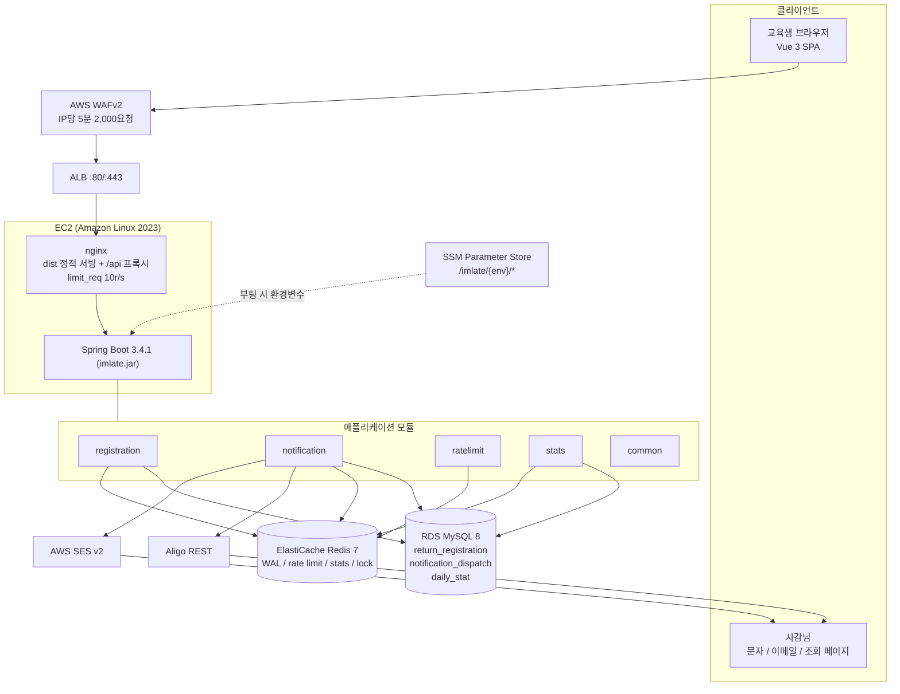
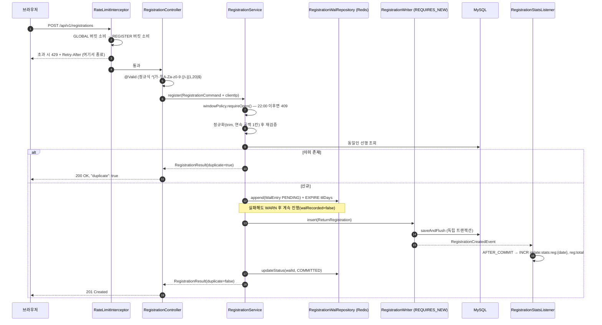
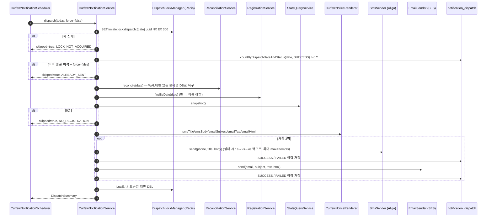
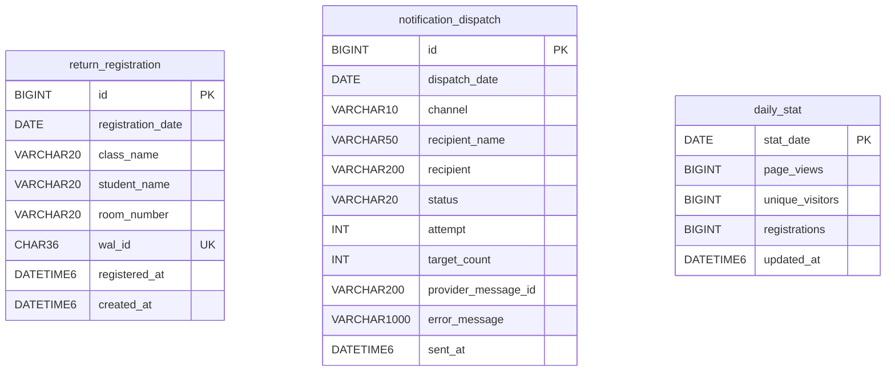

# imlate 아키텍처

이 문서는 **실제 구현된 코드**를 기준으로 작성되었습니다.
계약(클래스명·시그니처)은 [SPEC.md](SPEC.md), 엔드포인트 상세는 [API.md](API.md)를 보세요.

---

## 1. 전체 구성

### 모듈 책임

| 모듈 | 패키지 | 책임 |
|---|---|---|
| common | `com.skala.imlate.common` | 설정 프로퍼티, 에러 계약, `Clock`/Redis/CORS/Jackson/Async 설정, 조회 토큰·관리자 키, 클라이언트 IP 추출 |
| registration | `…registration` | 등록 창 정책, WAL 선행 기록, DB 저장, 대사(Reconciliation), 등록/조회 API |
| notification | `…notification` | 문구 렌더링, 문자/메일 채널, 22:10 스케줄러, 분산 락, 발송 이력, 관리 API |
| ratelimit | `…ratelimit` | Redis Lua 토큰 버킷, 로컬 폴백, `/api/**` 인터셉터, `X-RateLimit-*` 헤더 |
| stats | `…stats` | 방문/등록 카운터 수집, Redis→DB 폴백 조회, 일별 스냅샷 스케줄러, 통계 API |

### 인터셉터 실행 순서

| order | 인터셉터 | 경로 | 제외 |
|---|---|---|---|
| 0 | `RateLimitInterceptor` | `/api/**` | `/actuator/**`, `/error` |
| 200 | `StatsInterceptor` | `/api/**` | `/api/v1/stats/**`, `/actuator/**` |

rate limit이 먼저 실행되므로 **429로 차단된 요청은 방문 통계에 집계되지 않습니다.**

---

## 2. 등록 요청 시퀀스 (R7)

예외 경로:

| 상황 | 처리 |
|---|---|
| `DataIntegrityViolationException` + 재조회 성공 | WAL을 `COMMITTED`로 정리하고 **200 duplicate=true** |
| `DataIntegrityViolationException` + 재조회 실패 | WAL `FAILED`, `500 INTERNAL_ERROR` |
| 기타 런타임 예외 | WAL `FAILED` 후 예외 전파 |

### 왜 `register()`에 `@Transactional`을 걸지 않았나

1. 유니크 충돌이 발생한 트랜잭션은 rollback-only로 표시됩니다. 같은 트랜잭션 안에서 기존 레코드를 다시 조회하면
   커밋 시점에 `UnexpectedRollbackException`이 터집니다.
2. Redis I/O(수 ms~수백 ms) 동안 DB 커넥션을 붙잡지 않기 위해서입니다.

그래서 INSERT만 `RegistrationWriter#insert`(`@Transactional(REQUIRES_NEW)`)로 분리했고,
조회는 Spring Data가 메서드 단위로 여는 읽기 전용 트랜잭션에서 일어납니다.
`RegistrationCreatedEvent`는 **INSERT 트랜잭션 내부**에서 발행되므로 stats의
`@TransactionalEventListener(AFTER_COMMIT)`가 정상 수신합니다.

---

## 3. 22:10 발송 시퀀스 (R3, R8, R9)

`skipReason` 값: `NO_REGISTRATION` · `ALREADY_SENT` · `LOCK_NOT_ACQUIRED` · `DISABLED` · `NO_SUPERVISOR` · `NO_FAILURE`

### 설계 포인트

- **`CurfewNotificationService`에 `@Transactional`이 없습니다.** 외부 발송은 수 초가 걸릴 수 있어
  DB 커넥션을 잡아두면 안 됩니다. 이력은 리포지토리 호출 단위로 개별 커밋됩니다.
- **문자 길이 자동 대응**: 본문이 EUC-KR 기준 1,850바이트를 넘으면 이름/호수를 빼고
  "반별 인원 요약 + 조회 링크" 모드로 자동 전환합니다(LMS 2,000바이트 초과 방지).
  `AligoSmsSender`는 90바이트 초과 시 `msg_type=LMS`, 2,000바이트 초과 시 코드포인트 경계를 지켜 자르고 `…(생략)`을 붙입니다.
- **고정폭 표 정렬**: 한글은 표시 폭이 2이므로 문자 수가 아니라 `displayWidth()`(전각 2 / 반각 1)로 열을 맞춥니다.
  마지막 열은 패딩하지 않아 줄 끝 공백이 남지 않습니다.
- **HTML 이스케이프**: 명단은 사용자 입력이므로 이메일 HTML 렌더 시 `& < > " '`를 모두 이스케이프합니다.
- **발신자 표시 이름**: 한글이면 RFC 2047 Base64(`=?UTF-8?B?...?=`)로 인코딩해 메일 클라이언트에서 깨지지 않게 합니다.

---

## 4. 대사(Reconciliation) 판정 로직 (R8)

`ReconciliationService`는 WAL 항목의 `status`(PENDING/FAILED)를 **판정에 쓰지 않습니다.**
오직 **DB에 실제로 존재하는지**만 봅니다. 비교 키는 `personKey = date|class|name|room` 입니다.

| 조건 | status | 의미 |
|---|---|---|
| Redis PING 실패 또는 WAL 읽기 실패 | `WAL_UNAVAILABLE` | 대사 불가. DB 기준으로 발송/조회는 계속 진행 |
| 복구 후 차이 없음, 복구 0건 | `CONSISTENT` | 정상 |
| 복구 후 차이 없음, 복구 ≥ 1건 | `RECOVERED` | WAL에만 있던 등록을 DB로 살려냄 |
| `walOnly` 또는 `dbOnly` 가 남음 | `MISMATCH` | 경고 수준 (원인은 §7 참고) |

- `reconcile(date)` — 복구 수행. 22:10 발송 직전에 호출.
- `inspect(date)` — 복구 없이 비교만. 조회 페이지(`GET /api/v1/lookup`)가 호출.
- 복구 INSERT도 `RegistrationWriter#insert`(REQUIRES_NEW)를 거치므로,
  유니크 충돌이 나도 바깥 대사 트랜잭션이 rollback-only로 오염되지 않습니다.

---

## 5. 데이터 모델

세 테이블은 FK로 묶여 있지 않습니다. `dispatch_date` / `stat_date` / `registration_date` 라는
**날짜 키로 느슨하게 연결**되며, 발송·통계가 등록 트랜잭션을 지연시키지 않도록 의도한 구조입니다.

정의: `backend/src/main/resources/db/migration/V1__init.sql` (Flyway `V1__init`, utf8mb4/InnoDB)

| 제약 | 목적 |
|---|---|
| `uk_return_registration_person (registration_date, class_name, student_name, room_number)` | 같은 사람의 중복 등록 차단 → 멱등 응답의 근거 |
| `uk_return_registration_wal_id (wal_id)` | WAL 항목과 1:1 대응 → 복구 시 이중 삽입 방지 |
| `idx_return_registration_date` | 일자별 명단 조회 |
| `idx_notification_dispatch_date_status` | "오늘 SUCCESS 이력이 있는가" 판정 |

JPA는 `ddl-auto: validate` 로 스키마를 검증만 하고, 실제 생성/변경은 Flyway가 담당합니다.

---

## 6. Redis 키 맵

| 키 | 타입 | TTL | 쓰는 곳 | 용도 |
|---|---|---|---|---|
| `imlate:wal:{yyyy-MM-dd}` | HASH (field=walId, value=WalEntry JSON) | `imlate.wal.ttl-days` (기본 7일) | `RegistrationWalRepository` | 등록 선행 로그(WAL) |
| `imlate:rl:global:{clientIp}` | HASH (`tokens`, `ts`) | 가득 차는 시간 + 보충 주기 | `RedisRateLimiter` | 전역 토큰 버킷 |
| `imlate:rl:register:{clientIp}` | HASH | 〃 | 〃 | 등록 API 버킷 |
| `imlate:rl:lookup:{clientIp}` | HASH | 〃 | 〃 | 조회 API 버킷 |
| `imlate:lock:dispatch:{yyyy-MM-dd}` | STRING (uuid) | `imlate.notification.lock-ttl-seconds` (기본 300초) | `DispatchLockManager` | 발송 분산 락 |
| `imlate:stats:pv:total` | STRING 카운터 | 없음 | `StatsRecorder` | 누적 페이지뷰 |
| `imlate:stats:pv:{date}` | STRING 카운터 | 400일 | 〃 | 일별 페이지뷰 |
| `imlate:stats:uv:total` | HyperLogLog | 없음 | 〃 | 누적 순 방문자 |
| `imlate:stats:uv:{date}` | HyperLogLog | 400일 | 〃 | 일별 순 방문자 |
| `imlate:stats:reg:{date}` | STRING 카운터 | 400일 | `RegistrationStatsListener` | 일별 등록 수 |
| `imlate:stats:reg:total` | STRING 카운터 | 없음 | 〃 | 누적 등록 수 |
| `imlate:stats:days` | SET (yyyy-MM-dd) | 없음 | `StatsRecorder` | 통계가 기록된 일자 목록 |

- 누계 키(`*:total`)와 `imlate:stats:days`에는 TTL이 없습니다. ElastiCache `maxmemory-policy = volatile-lru`
  설정과 맞물려 **TTL 없는 키는 축출되지 않습니다.**
- WAL 값은 `StringRedisTemplate` + `imlateObjectMapper`로 **JSON 문자열을 직접** 다룹니다.
  제네릭 직렬화기를 쓰지 않아 라이브러리 버전이 바뀌어도 기존 데이터를 계속 읽을 수 있고,
  `FAIL_ON_UNKNOWN_PROPERTIES=false` 로 필드가 추가된 구버전 JSON도 관용적으로 읽습니다.
- 방문자 식별자는 `X-Visitor-Id` 헤더(localStorage UUID)를 우선 쓰고, 없으면
  `sha256(clientIp + "|" + 일자)` 앞 16자를 씁니다. **날짜를 솔트로 섞어 장기 추적이 불가능**합니다.
  헤더 값은 영숫자·`-`·`_` 만 남기고 8~64자로 정제해 임의 문자열이 Redis로 흘러들지 않게 합니다.

---

## 7. 장애 시나리오별 동작

| 장애 | 동작 | 사용자 영향 |
|---|---|---|
| **Redis 다운 (등록 시)** | `walRepository.append()` 예외를 잡아 WARN 로그 후 **등록 계속 진행**(`walRecorded=false`). `updateStatus`는 내부에서 예외를 삼킴 | 없음. 등록 정상 완료 |
| **Redis 다운 (대사 시)** | `isAvailable()`가 false → `WAL_UNAVAILABLE` 보고. 발송/조회는 DB 기준으로 계속 | 조회 페이지 검증 배지가 "WAL 확인 불가" |
| **Redis 다운 (rate limit)** | `CompositeRateLimiter`가 예외를 흡수. `fail-open=true`(기본)면 인메모리 고정 윈도우 리미터로 강등, `false`면 429 | 기본 설정에서는 없음 |
| **Redis 다운 (통계)** | `StatsRecorder`는 예외를 삼키고, `StatsQueryService`는 `daily_stat` 스냅샷으로 폴백. 최종 실패 시 0 | 통계 수치만 일시적으로 0/과거값 |
| **Redis 다운 (발송 락)** | `tryAcquire()`가 true를 반환해 **락 없이 진행**. 중복 발송은 `notification_dispatch`의 SUCCESS 이력으로 차단 | 없음 |
| **DB 다운 (등록)** | INSERT 실패 → WAL `FAILED` → 예외 전파 → `500 INTERNAL_ERROR`. **WAL에는 남아 있으므로** 복구 후 22:10 대사에서 자동 복구 | 재시도 안내. 명단 누락은 없음 |
| **DB 다운 (조회/통계)** | `LookupController`는 통계 조회 실패를 0으로 대체. 명단 조회 실패는 500 | 조회 불가(일시적) |
| **Aligo 실패** | `SendResult.fail` 반환(예외 전파 없음) → 1s→2s→4s 백오프로 `maxAttempts`까지 재시도 → 최종 FAILED 이력 저장 → 22:25/22:40 `retryFailed()`가 재발송 | 이메일은 정상 발송됨 |
| **SES 실패** | 동일(채널 독립). SES 자격증명·검증 실패도 `SendResult.fail` | 문자는 정상 발송됨 |
| **스케줄러 중복 실행 (다중 인스턴스)** | Redis `SET NX EX`로 1대만 진입. 락 획득 실패 시 `LOCK_NOT_ACQUIRED`로 skip. 락 해제는 Lua로 **내 토큰일 때만 DEL** | 없음 |
| **스케줄러 예외** | 스케줄러 메서드가 모든 예외를 잡아 로그만 남김(스레드 사망 방지) | 다음 재시도 cron에서 복구 |
| **WAL TTL 만료 후 대사** | DB에만 있는 항목이 `dbOnly`로 남아 `MISMATCH`. 데이터 손실은 아님 | 검증 배지가 "불일치"로 표시 |

---

## 8. Rate limiting — 3단 방어 (R14)

| 계층 | 위치 | 단위 | 목적 |
|---|---|---|---|
| 1단 | AWS WAFv2 (`infra/terraform/modules/waf`) | IP당 5분 2,000요청 + AWSManagedRulesCommonRuleSet | L7 DDoS·스크래핑을 ALB 도달 전에 차단 |
| 2단 | nginx (`infra/nginx/imlate.conf`) | `/api/` 10r/s burst 20, 동시 연결 40 | 인스턴스 한 대를 지키는 최후 방어선 |
| 3단 | 애플리케이션 (`ratelimit` 모듈) | 전역 120/분, 등록 8/분, 조회 40/분 | 엔드포인트별 정밀 제어 |

### 애플리케이션 토큰 버킷

- 스크립트: `backend/src/main/resources/redis/rate_limit_token_bucket.lua`
- `KEYS[1]` = 버킷 키, `ARGV` = `capacity, refillTokens, refillPeriodMs, nowMs, requested`
- 반환: **`{allowed, remaining, retryAfterMs, resetMs}` 4개 값** (`resetMs`는 `X-RateLimit-Reset` 헤더에 필요)
- `DefaultRedisScript`로 SHA 캐싱 → 요청당 1 RTT
- **`HSET` 대신 `HMSET`을 씁니다.** 가변 인자 `HSET`은 Redis 4.0+ 전용이라 구버전(예: 3.x) 환경에서 실패합니다.
  `HMSET`은 2.6~7.x 전 버전에서 동작하고 커맨드 수도 동일합니다.
- `nowMs`를 **호출자가 넘깁니다.** 스크립트가 결정적이어야 복제/AOF에서 안전하고,
  한 요청 안에서 GLOBAL/REGISTER 두 스코프의 기준 시각을 하나로 통일할 수 있습니다.
- 시계 역행(NTP 보정) 방어: 저장된 `ts`가 미래면 현재로 당깁니다.

### 스코프 결정

| 요청 | 소비하는 버킷 |
|---|---|
| `POST /api/v1/registrations` | GLOBAL → (통과 시) REGISTER |
| `/api/v1/lookup…` | GLOBAL → (통과 시) LOOKUP |
| 그 외 `/api/**` | GLOBAL |

요청당 Redis 호출은 **최대 2회**입니다. GLOBAL에서 이미 막히면 두 번째 호출을 하지 않습니다.
`OPTIONS`(CORS preflight)와 `/actuator/**`는 계산에서 제외합니다.

### 예외 정책

인터셉터는 **어떤 예외도 밖으로 던지지 않습니다.** 실패 시 요청을 통과시킵니다(rate limit은 부가 기능).
429 응답은 컨트롤러에 도달하지 않으므로 인터셉터가 `ErrorResponse` JSON을 직접 씁니다.
이때 `response.reset()`을 하지 않습니다 — CORS 인터셉터가 넣어 둔 `Access-Control-*` 헤더가 지워지면
브라우저가 429 본문을 읽지 못하기 때문입니다.

---

## 9. 보안

| 항목 | 구현 |
|---|---|
| 조회 페이지 인증 | HMAC-SHA256 토큰. `base64url(exp) + "." + base64url(hmac(secret, date + ":" + exp))`. 기본 TTL 48시간. `MessageDigest.isEqual`로 상수시간 비교 |
| 관리 API 인증 | `X-Admin-Key` 헤더, 상수시간 비교. 키 미설정 시 전부 401 |
| 입력 검증 | 컨트롤러 `@Valid` 정규식 + 서비스에서 정규화 후 **한 번 더** 검증(이중 방어) |
| XSS | 이메일 HTML 렌더 시 명단 값 전부 이스케이프. 프론트는 Vue 기본 이스케이프 |
| PII 노출 최소화 | 공개 API(`/registrations/summary`, `/stats/summary`)에는 이름·호수가 없음. 로그에서 전화번호/이메일은 마스킹(`PhoneNumbers.mask`) |
| 에러 응답 | 스택 트레이스·내부 메시지 비노출(`server.error.include-*: never`). 상세는 로그로만 |
| CORS | `imlate.web.allowed-origins` 화이트리스트, `allowCredentials=false`, 메서드 `GET/POST/OPTIONS` |
| 시크릿 | 저장소에 실제 값 없음. SSM SecureString → EC2 환경변수. `application-secret.yml`·`*.tfvars`는 `.gitignore` |
| 프록시 신뢰 | 운영 프로파일 `forward-headers-strategy: framework`, `ClientIpResolver`가 `X-Forwarded-For` 첫 IP 사용 |

---

## 10. 주요 설계 판단과 근거

**1. WAL을 Redis에, 본체를 MySQL에 — 왜 두 번 쓰나**
등록은 하루 중 22:00 직전에 몰립니다. DB 장애·커넥션 고갈로 INSERT가 실패해도 학생 입장에서는
"등록했는데 명단에 없다"가 되면 안 됩니다. Redis에 먼저 선행 기록을 남겨두면 22:10 대사에서 자동 복구됩니다.
반대로 Redis가 죽어도 등록은 계속되게 해 **가용성을 우선**했습니다(그 경우 `dbOnly`로 남아 MISMATCH 표시).

**2. 멱등 등록 (중복 시 200 + `duplicate=true`)**
새로고침·중복 제출은 흔합니다. 유니크 제약 + 선행 조회 + 충돌 시 재조회로 항상 같은 결과를 돌려줍니다.
에러가 아니라 정상 응답으로 처리해 프론트가 "이미 등록되어 있습니다"를 자연스럽게 안내합니다.

**3. 서버 시간 기준 카운트다운**
클라이언트 시계는 틀릴 수 있습니다. `GET /registrations/window`가 `serverTime`/`closesAt`/`secondsUntilClose`를
내려주고 프론트는 오차(offset)를 저장해 계산합니다. 마감 판정은 언제나 서버가 합니다.

**4. 통계는 이벤트로 분리**
`RegistrationService`가 직접 카운트하지 않고 `RegistrationCreatedEvent`만 발행합니다.
stats 모듈이 `AFTER_COMMIT`에 반응하므로 **롤백된 등록은 집계되지 않고**, 통계 장애가 등록 경로를 막지 않습니다.

**5. HyperLogLog로 순 방문자**
200명 규모에 정확한 집합 연산은 과합니다. HLL은 키 하나가 12KB 고정이고 오차 0.81%로 충분합니다.

**6. 발송 이력을 DB에 남기는 이유**
Redis 락은 TTL 300초라 그 이후의 중복 발송을 막지 못합니다. `notification_dispatch`의 SUCCESS 이력이
**Redis 없이도 동작하는 최종 안전장치**이자, 실패 채널만 골라 재시도하는 근거입니다.

**7. Noop 채널을 기본값으로**
`imlate.sms.provider` / `imlate.email.provider` 기본값이 `noop`이라 **AWS 자격증명 없이도 기동**됩니다.
`SesClientConfig`와 `aligoRestClient` 빈은 각각 `provider=ses` / `provider=aligo` 일 때만 생성됩니다.
오타(예: `alligo`)를 넣으면 빈이 없어 기동에 실패합니다 — 의도된 fail-fast입니다.

**8. Terraform 모듈 분리 + SSM 경유 시크릿**
인프라 변경이 애플리케이션 코드 수정으로 이어지지 않도록 호스트·포트·키를 전부 프로퍼티화했습니다(R10).
`user_data`에는 민감값을 넣지 않고(평문 노출) SSM SecureString에서 부팅 시 읽어 옵니다.
